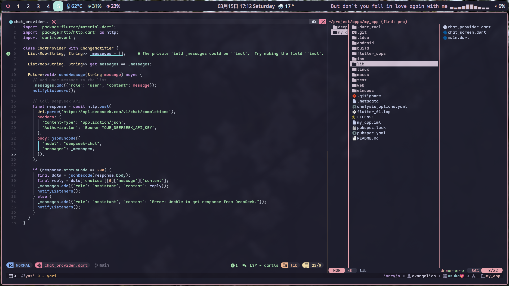
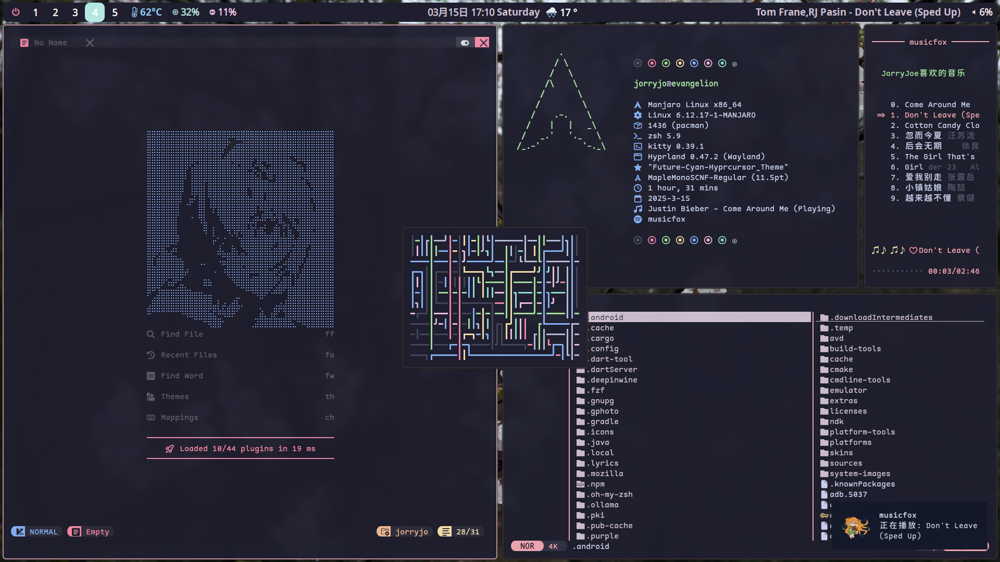

# My Hyprland Configuration!


***Based On Archlinux***
## Requirements
### 1.hyprland 0.46.1 
You can install it by visiting the [Hyprland](https://hyprland.org)
Every single Configuration here can be found.
No more modules i added.
### 2.mpvpaper
It's a video wallpaper engine that could be used in wayland for free.
```
sudo pacman -S mpvpaper #or yay
```

### 3.***waybar***
I paid a lot of time on it,
It includes various modules,some of them are newly appear.
#### [Waylrc](https://github.com/hafeoz/waylrc)
#### [wttrbar](https://github.com/bjesus/wttrbar)

### 4.Neovim
Based on [Nvchad](https://github.com/NvChad/NvChad)

# To be continue!
